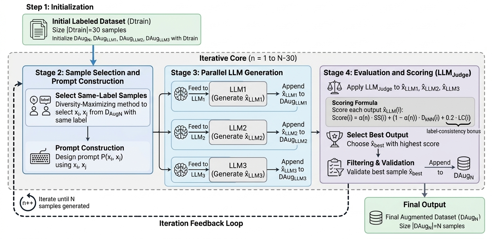

# AraAugLLM

**Using LLMs for Text Generation and Evaluation in a Unified Text Augmentation Framework**

[](https://doi.org/xxx)
[](LICENSE)
[](https://www.python.org/)
[]()

AraAugLLM is a unified text augmentation framework that combines **competitive multi-LLM generation** with an **LLM-as-a-Judge scoring mechanism** to produce high-quality synthetic training data for Arabic (and other low-resource language) classification tasks.

<p align="center">
  
</p>

---

## Highlights

- **Multi-LLM Generation** — Three instruction-tuned LLMs (Command-R7B-Arabic, LLaMA-3.3-70B-Instruct, Qwen-2.5-72B-Instruct) independently generate candidate augmentations from the same few-shot prompt.
- **LLM-as-a-Judge** — GPT-4o evaluates each candidate for label consistency, returning a confidence score that enters the selection formula.
- **Adaptive Scoring** — A weighted combination of semantic similarity, k-NN diversity, and label-consistency confidence, with weights that shift from fidelity-first to diversity-first as augmentation progresses.
- **Diversity-Maximising Few-Shot Selection** — Prompt examples are chosen to maximise mutual embedding distance within the same class, encouraging generators to explore the full class manifold.
- **Quality Safeguards** — Multi-layered validation with adaptive semantic thresholds, label-consistency hard gates, and length filters.

## Results Summary

Starting from only **30 labeled samples**, AraAugLLM achieves consistent gains across three Arabic classification benchmarks:

| Dataset | Dtrain Acc | AraAugLLM (N=200) Acc | Gain |
|---------|-----------|----------------------|------|
| HARD    | 37.9%     | 66.2%                | +28.3pp |
| Emotone | 35.4%     | 68.9%                | +33.5pp |
| ArSAS   | 40.4%     | 69.1%                | +28.7pp |

AraAugLLM outperforms every single-LLM baseline at every augmentation size, with lower run-to-run variance.

## Framework Architecture

```
┌─────────────────────────────────────────────────────────────────┐
│                    AraAugLLM Pipeline                            │
│                                                                  │
│  ┌──────────┐   ┌──────────────┐   ┌────────────────────────┐   │
│  │ D_train  │──▶│ Max-Distance │──▶│ Parallel LLM Generation│   │
│  │ (30 samp)│   │ Few-Shot Sel │   │  ┌─────┐ ┌─────┐ ┌───┐│   │
│  └──────────┘   └──────────────┘   │  │LLM1 │ │LLM2 │ │LLM││   │
│                                     │  └──┬──┘ └──┬──┘ └─┬─┘│   │
│                                     └─────┼───────┼──────┼───┘   │
│                                           ▼       ▼      ▼       │
│                                    ┌──────────────────────────┐  │
│                                    │  Evaluation & Scoring    │  │
│                                    │  SS + D_kNN + LC (GPT-4o)│  │
│                                    └────────────┬─────────────┘  │
│                                                 ▼                │
│                                    ┌──────────────────────────┐  │
│                                    │  Filter & Validate       │  │
│                                    │  → Append best to D_AugN │  │
│                                    └──────────────────────────┘  │
│                                                 │                │
│                              ◀──── Iterate ─────┘                │
└─────────────────────────────────────────────────────────────────┘
```

## Installation

```bash
git clone https://github.com/YOUR_USERNAME/AraAugLLM.git
cd AraAugLLM
pip install -r requirements.txt
```

### Dependencies

- Python ≥ 3.9
- `transformers` ≥ 4.40
- `torch` ≥ 2.0
- `sentence-transformers` (for jina-embeddings-v3)
- `openai` (for GPT-4o judge API)
- `scikit-learn`
- `numpy`, `pandas`

## Quick Start

### 1. Configure API Keys

```bash
export OPENROUTER_API_KEY="your_openrouter_key"    # For Command-R7B, LLaMA, Qwen
export OPENAI_API_KEY="your_openai_key"              # For GPT-4o judge
```

### 2. Prepare Seed Data

Place your labeled seed dataset (minimum 30 samples, balanced across classes) in `data/`:

```
data/
├── hard_seed.csv        # text, label columns
├── emotone_seed.csv
└── arsas_seed.csv
```

### 3. Run Augmentation

```bash
python augment.py \
    --seed_data data/hard_seed.csv \
    --target_size 200 \
    --output_dir outputs/hard_aug200 \
    --embedding_model jinaai/jina-embeddings-v3 \
    --judge_model gpt-4o \
    --k_neighbors 5 \
    --ss_threshold_init 0.65 \
    --ss_decay_lambda 0.3
```

### 4. Train Classifier

```bash
python train_classifier.py \
    --train_data outputs/hard_aug200/augmented_dataset.csv \
    --test_data data/hard_test.csv \
    --model UBC-NLP/MARBERTv2 \
    --epochs 5 \
    --batch_size 32 \
    --learning_rate 2e-5 \
    --num_runs 5
```

## Project Structure

```
AraAugLLM/
├── augment.py                 # Main augmentation pipeline
├── train_classifier.py        # MARBERT-v2 fine-tuning & evaluation
├── config/
│   └── default.yaml           # Default hyperparameters
├── src/
│   ├── generators/
│   │   ├── base.py            # Generator interface
│   │   ├── command_r7b.py     # Command-R7B-Arabic generator
│   │   ├── llama.py           # LLaMA-3.3-70B generator
│   │   └── qwen.py            # Qwen-2.5-72B generator
│   ├── judge/
│   │   └── gpt4o_judge.py     # GPT-4o label-consistency evaluator
│   ├── scoring/
│   │   ├── semantic_sim.py    # Cosine similarity (Eq. 2)
│   │   ├── knn_diversity.py   # k-NN diversity score (Eq. 3)
│   │   ├── adaptive.py        # Adaptive scoring formula (Eq. 5-6)
│   │   └── threshold.py       # Adaptive threshold τ(n) (Eq. 8)
│   ├── selection/
│   │   └── max_distance.py    # Diversity-maximising few-shot selection (Eq. 1)
│   ├── validation/
│   │   └── filters.py         # Label gate, SS threshold, length check
│   └── utils/
│       ├── embeddings.py      # Embedding cache management
│       └── prompts.py         # Prompt template construction
├── data/
│   ├── hard_seed.csv
│   ├── emotone_seed.csv
│   └── arsas_seed.csv
├── outputs/                   # Generated augmented datasets
├── notebooks/
│   ├── analysis.ipynb         # Results analysis & visualisation
│   └── ablation.ipynb         # Ablation study reproduction
├── requirements.txt
├── LICENSE
└── README.md
```

## Key Hyperparameters

| Parameter | Default | Description |
|-----------|---------|-------------|
| `target_size` (N) | 200 | Number of samples in the final augmented dataset |
| `seed_size` | 30 | Initial labeled samples (balanced across classes) |
| `k_neighbors` | 5 | k for k-NN diversity score |
| `alpha_start` | 0.7 | Initial semantic similarity weight |
| `alpha_end` | 0.4 | Final semantic similarity weight |
| `lc_bonus` | 0.2 | Label-consistency bonus coefficient |
| `ss_threshold_init` | 0.65 | Initial adaptive semantic threshold τ(0) |
| `ss_decay_lambda` | 0.3 | Decay rate for threshold relaxation |
| `min_word_count` | 8 | Minimum candidate length (words) |
| `temperature` | 0.0 | Decoding temperature (deterministic) |
| `top_p` | 1.0 | Nucleus sampling parameter |
| `max_tokens` | 512 | Maximum generation length |

## Generator Models

| Model | Parameters | Context | Access |
|-------|-----------|---------|--------|
| Command-R7B-Arabic | 7B | 4,096 tokens | OpenRouter API |
| LLaMA-3.3-70B-Instruct | 70B | 128K tokens | OpenRouter API |
| Qwen-2.5-72B-Instruct | 72.7B | 131K tokens | OpenRouter / HuggingFace API |
| GPT-4o (Judge) | — | 128K tokens | OpenAI API |

## Scoring Formula

The adaptive scoring function balances semantic fidelity and diversity:

```
Score(i) = α(n) · SS(i) + (1 - α(n)) · D_kNN(i) + 0.2 · LC(i)

where:
  α(n) = 0.7 - 0.3 × (n/N)          # Decays from 0.7 → 0.4
  SS(i) = cos(e_prompt, e_gen)        # Semantic similarity
  D_kNN(i) = 1 - mean(cos neighbors)  # k-NN diversity
  LC(i) = GPT-4o confidence | Yes     # Label-consistency confidence
```

## Datasets

| Dataset | Domain | Size | Classes Used | Source |
|---------|--------|------|-------------|--------|
| [HARD](https://huggingface.co/datasets/Elnagara/hard) | Hotel reviews | 93,700 | 3 | Elnagar et al. 2018 |
| [Emotone](https://github.com/amrmalkhatib/Emotional-Tone) | Tweet emotions | 10,000+ | 3 | Al-Khatib & El-Beltagy 2017 |
| [ArSAS](http://homepages.inf.ed.ac.uk/wmagdy/resources.htm) | Tweet sentiment | 21,000 | 3 | AbdelRahim & Magdy 2018 |

## Reproducing Results

```bash
# Full reproduction: all datasets, all augmentation sizes, 5 runs each
python scripts/reproduce_all.py --datasets hard emotone arsas \
    --sizes 50 80 100 120 150 200 \
    --num_runs 5 \
    --output_dir results/

# Ablation study (HARD dataset only)
python scripts/run_ablation.py --dataset hard \
    --sizes 50 80 100 120 150 200 \
    --num_runs 5

# Scaling experiment (HARD, N=50 to 1000)
python scripts/run_scaling.py --dataset hard \
    --max_size 1000 --step 50
```

## Extending to Other Languages

AraAugLLM is language-agnostic by design. To adapt for a new language:

1. **Generators** — Replace with instruction-tuned LLMs proficient in the target language.
2. **Embeddings** — Use a multilingual embedding model (jina-embeddings-v3 already supports 100+ languages).
3. **Judge prompt** — Translate the label-consistency prompt to the target language.
4. **Seed data** — Provide a balanced labeled seed set of ≥30 samples.

```python
# Example: adapting for French
config = {
    "generators": ["mistral-7b-instruct", "llama-3.3-70b", "qwen-2.5-72b"],
    "judge": "gpt-4o",
    "prompt_language": "fr",
    "embedding_model": "jinaai/jina-embeddings-v3",
}
```

## Citation

If you use AraAugLLM in your research, please cite:

```bibtex
@article{mars2026araugllm,
  title={{AraAugLLM}: Using {LLMs} for Text Generation and Evaluation in a Unified Text Augmentation Framework},
  author={Mars, Mourad},
  journal={xxxxx},
  year={2026},
  doi={xxx/xxxx}
}
```

## Acknowledgements

This research was funded by **Umm Al-Qura University**, Saudi Arabia under grant number **26UQU4350491GSSR04**.

## License

This project is licensed under the MIT License — see the [LICENSE](LICENSE) file for details.

---

<p align="center">
  <b>AraAugLLM</b> — Principled text augmentation for low-resource NLP<br>
  <a href="mailto:msmars@uqu.edu.sa">Contact</a> · <a href="https://doi.org/xxx">Paper</a> · <a href="#citation">Cite</a>
</p>
